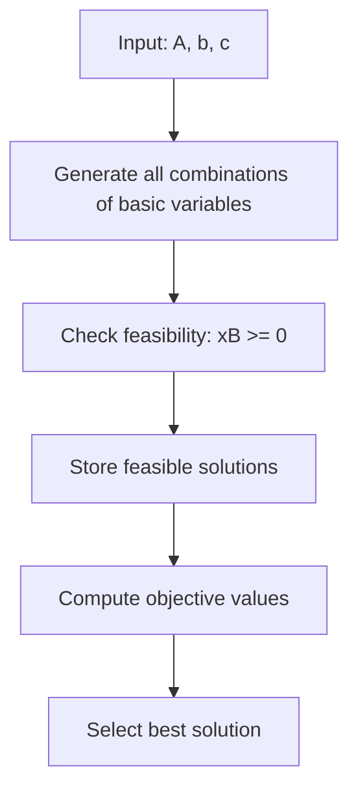

# Optimization Techniques

Welcome to the **Optimization Techniques** repository!  
This project provides a modular and extensible framework for solving mathematical optimization problems using a variety of algorithms and utilities, with support for both MATLAB and Python implementations.

---

## ✨ Features

- **Multiple optimization algorithms**: Linear programming, basic feasible solution enumeration, and more.
- **Cross-language support**: MATLAB and Python code for flexibility and learning.
- **Utilities**: Data preprocessing, helper functions, and result analysis.
- **Well-documented**: Clear code comments, usage examples, and visual explanations.
- **Easy to extend**: Add your own algorithms or utilities.

---

## 📂 Repository Structure

```
optimization/
│
├── code/                # Main source code for optimization algorithms
│   ├── Basic_Solutions_and_Bounded_LPP.m   # MATLAB: BFS and bounded LPP solver
│   ├── optimizer.py                        # (Optional) Python optimizer
│   ├── utils.py                            # (Optional) Python utilities
│   └── __init__.py                         # (Optional) Python package marker
│   └── README.md                           # Code folder documentation
│
├── data/                # Datasets and input files
├── tests/               # Unit and integration tests
├── results/             # Output results, logs, and figures
├── README.md            # Project documentation (this file)
└── LICENSE              # License information
```

---

## 🖼️ Visual Overview

### General Workflow

```mermaid
flowchart TD
    A[Input Data] --> B[Preprocessing (utils.py)]
    B --> C[Optimization Algorithm (optimizer.py)]
    C --> D[Results Output]
```

### MATLAB Example: Basic Solutions and Bounded LPP



---

## 🚀 Getting Started

### 1. Clone the Repository

```bash
git clone https://github.com/yourusername/optimization.git
cd optimization
```

### 2. Install Dependencies

- **Python:**  
  Make sure you have Python 3.8+ installed.  
  Install dependencies (if any) with:
  ```bash
  pip install -r requirements.txt
  ```
- **MATLAB:**  
  No installation required for MATLAB scripts. Open `.m` files directly in MATLAB.

### 3. Run an Example

- **MATLAB:**  
  Open `code/Basic_Solutions_and_Bounded_LPP.m` in MATLAB and run:
  ```matlab
  A = [1 2; 3 4; 5 6];
  b = [7; 8; 9];
  c = [1 1];
  [BFS, z_best, x_best] = Basic_Solutions_and_Bounded_LPP(A, b, c);
  disp(BFS);
  disp(z_best);
  disp(x_best);
  ```
- **Python:**  
  (If `optimizer.py` is present)
  ```bash
  python code/optimizer.py --input data/sample_input.csv
  ```

---

## 🧩 Code Folder Overview

See [`code/README.md`](code/README.md) for a detailed breakdown of the code folder, including file purposes and usage.

---

## 📝 Example MATLAB Function

**File:** `code/Basic_Solutions_and_Bounded_LPP.m`

This function finds all basic feasible solutions (BFS) for a linear system and identifies the one that maximizes the objective function.

**Signature:**
```matlab
function [BFS, z_best, x_best] = Basic_Solutions_and_Bounded_LPP(A, b, c)
```
- **Inputs:**  
  - `A`: Constraint matrix (m x n)  
  - `b`: Right-hand side vector (m x 1)  
  - `c`: Objective function coefficients (1 x n)  
- **Outputs:**  
  - `BFS`: All basic feasible solutions found  
  - `z_best`: Maximum objective value  
  - `x_best`: Corresponding variable values for `z_best`  

---

## 🛠️ Contributing

Contributions are welcome!  
- Open issues for bug reports or feature requests.
- Submit pull requests for improvements or new algorithms.
- For major changes, please open an issue first to discuss your ideas.

---

## 📚 References

- [Linear Programming - Wikipedia](https://en.wikipedia.org/wiki/Linear_programming)
- [Mathematical Optimization - Wikipedia](https://en.wikipedia.org/wiki/Mathematical_optimization)
- [MATLAB Documentation](https://www.mathworks.com/help/matlab/)

---

## 📄 License

This project is licensed under the MIT License.  
See [LICENSE](./LICENSE) for details.
