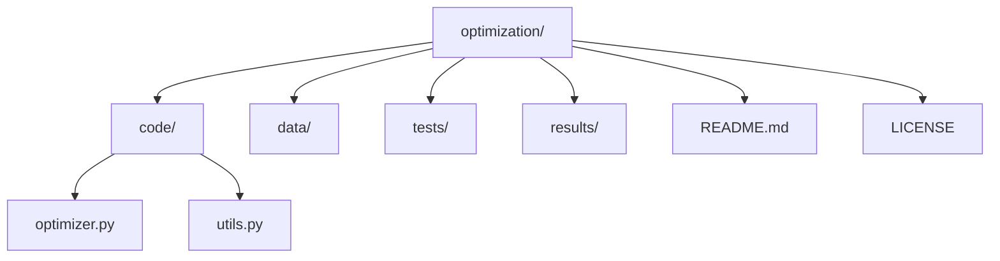

# Optimization Project

Welcome to the **Optimization** project!  
This repository provides a modular framework for solving mathematical optimization problems using various algorithms and utilities.

---

## ✨ Features

- **Modular codebase** for easy extension  
- **Multiple optimization algorithms** supported  
- **Utilities** for data preprocessing and result analysis  
- **Example scripts** and **test cases**  
- **Well-documented** and easy to use  

---

## 📂 Repository Structure

```
optimization/
│
├── code/                # Main source code for optimization algorithms
│   ├── __init__.py
│   ├── optimizer.py     # Core optimization logic
│   ├── utils.py         # Helper functions
│   └── ...              # Additional modules
│
├── data/                # Datasets and input files
├── tests/               # Unit and integration tests
├── results/             # Output results, logs, and figures
├── README.md            # Project documentation
└── LICENSE              # License information
```

---

## 🖼️ Visual Overview

### Workflow Diagram

```mermaid
flowchart TD
    A[Input Data] --> B[Preprocessing (utils.py)]
    B --> C[Optimization Algorithm (optimizer.py)]
    C --> D[Results Output]
```

### Folder Structure



---

## 🚀 Getting Started

**1. Clone the Repository**
```bash
git clone https://github.com/yourusername/optimization.git
cd optimization
```

**2. Install Dependencies**  
Make sure you have Python 3.8+ installed. Then run:
```bash
pip install -r requirements.txt
```

**3. Run an Example**
```bash
python code/optimizer.py --input data/sample_input.csv
```

---

## 🧩 Code Folder Overview

The `code/` directory contains all the main logic for the optimization routines.

| File            | Description                                 |
|-----------------|---------------------------------------------|
| `optimizer.py`  | Implements core optimization algorithms     |
| `utils.py`      | Utility functions for data processing       |
| `__init__.py`   | Makes `code` a Python package               |

---

## 📝 Example Usage

```python
from code.optimizer import Optimizer

optimizer = Optimizer(params)
result = optimizer.optimize(data)
print(result)
```

---

## 📚 References

- [Optimization Algorithms Overview](https://en.wikipedia.org/wiki/Mathematical_optimization)
- [Project Wiki](https://github.com/yourusername/optimization/wiki)

---

## 🛠️ Contributing

Contributions are welcome!  
Please open issues or submit pull requests.  
For major changes, please open an issue first to discuss what you would like to change.

---

## 📄 License

This project is licensed under the MIT License.  
See [LICENSE](./LICENSE) for details.