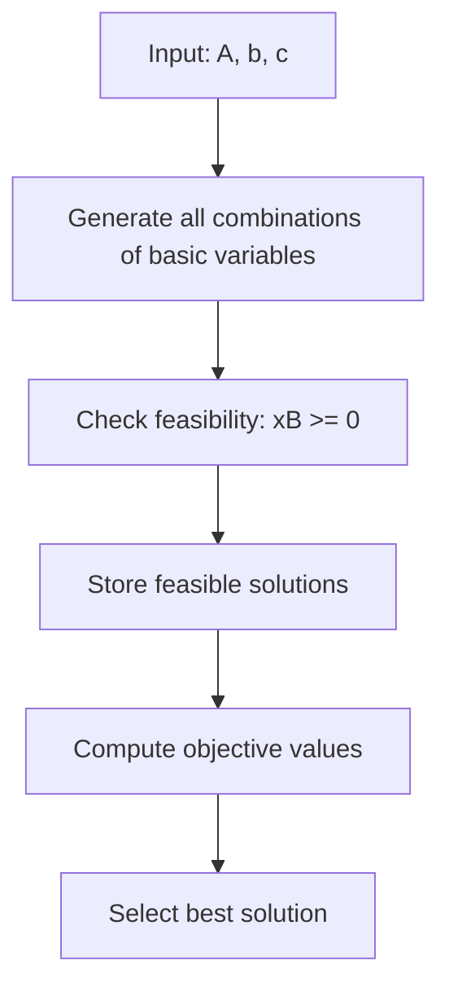

# Code Folder Overview

This folder contains the core source code for the **Optimization Project**. Here, you will find implementations of algorithms, utilities, and scripts for solving mathematical optimization problems.

---

## 📦 Folder Contents

| File/Module                              | Description                                      |
|-------------------------------------------|--------------------------------------------------|
| `Basic_Solutions_and_Bounded_LPP.m`      | MATLAB function to compute basic feasible solutions and solve bounded Linear Programming Problems (LPP) |
| `optimizer.py` / `utils.py` (if present) | Python modules for optimization logic and helpers |
| `__init__.py`                            | Makes this folder a Python package (if present)   |

---

## 🧮 Example: Basic Solutions and Bounded LPP

### Purpose

The `Basic_Solutions_and_Bounded_LPP.m` script finds all basic feasible solutions (BFS) for a given linear system and identifies the one that maximizes the objective function.

### Visual Workflow

<!-- Mermaid diagram syntax fixed for compatibility -->


### Function Signature

```matlab
function [BFS, z_best, x_best] = Basic_Solutions_and_Bounded_LPP(A, b, c)
```

- **Inputs:**
  - `A`: Constraint matrix (m x n)
  - `b`: Right-hand side vector (m x 1)
  - `c`: Objective function coefficients (1 x n)
- **Outputs:**
  - `BFS`: All basic feasible solutions found
  - `z_best`: Maximum objective value
  - `x_best`: Corresponding variable values for `z_best`

---

## 📝 Usage Example

```matlab
A = [1 2; 3 4; 5 6];
b = [7; 8; 9];
c = [1 1];
[BFS, z_best, x_best] = Basic_Solutions_and_Bounded_LPP(A, b, c);
disp(BFS);
disp(z_best);
disp(x_best);
```

---

## 🗂️ Adding New Algorithms

- Place new MATLAB or Python scripts in this folder.
- Add a short docstring or comment at the top of each file describing its purpose.
- Update this README with a brief description of the new file.

---

## 🖼️ Folder Structure

```
code/
├── Basic_Solutions_and_Bounded_LPP.m   # MATLAB LPP solver
├── optimizer.py                        # (Optional) Python optimizer
├── utils.py                            # (Optional) Python utilities
└── README.md                           # This documentation
```

---

## 📚 References

- [Linear Programming - Wikipedia](https://en.wikipedia.org/wiki/Linear_programming)
- [MATLAB Documentation](https://www.mathworks.com/help/matlab/)

---
